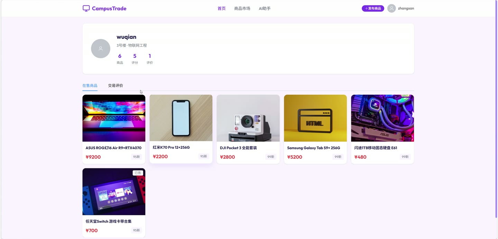
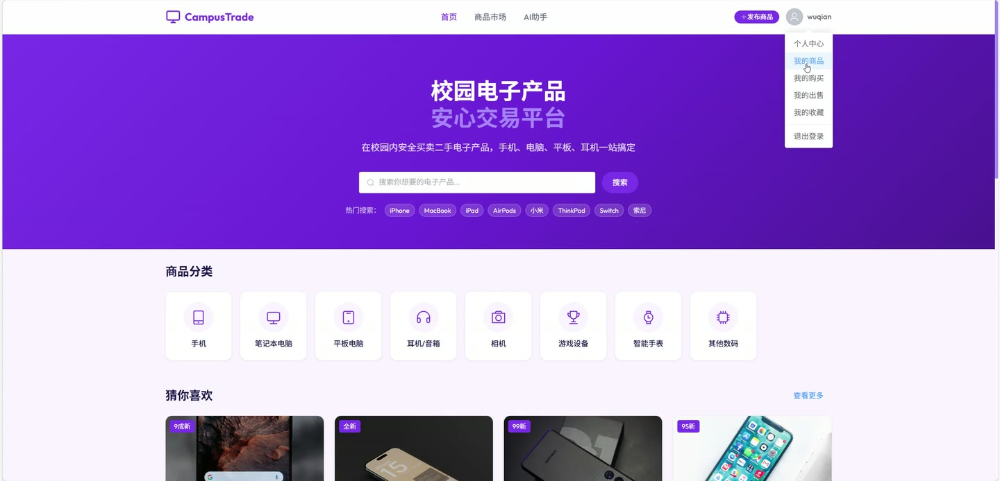

# (附文档)Springboot3+Vue3+MySQL 校园电子产品交易系统

**技术栈**：Springboot3、Vue3、MySQL

### 系统简介

校园电子产品交易系统是一套基于 SpringBoot3 + Vue3 前后端分离架构的二手电子产品交易平台，支持普通用户（买家/卖家）与管理员双角色操作。系统提供商品发布审核、在线交易、订单管理、AI 智能导购、收藏评价等完整功能链路，适用于校园场景下的二手电子产品流通管理。
 
### 核心功能
 
### 普通用户端

 
- 用户注册与登录：通过学号注册账号，登录后获取 JWT Token 进行身份认证 
- 商品浏览与筛选：按分类、关键词、成色、交易地点、价格区间筛选在售商品列表 
- 商品详情查看：查看商品图片、描述、价格、卖家信息，自动记录浏览历史 
- 发布商品：填写商品名称、分类、成色、价格、描述、图片等信息，提交后进入待审核状态 
- 编辑/删除商品：修改自己发布的商品（修改后重新审核），或删除下架商品 
- 收藏商品：点击收藏按钮收藏/取消收藏商品，在“我的收藏”查看收藏列表 
- 购买下单：选择商品创建订单，填写支付方式和备注，生成订单编号 
- 模拟支付：对待付款订单执行模拟支付，支付后商品状态变为已售 
- 确认收货：对待收货订单确认收货，订单状态变为已完成 
- 取消订单：对未发货或未收货的订单取消操作，恢复商品在售状态 
- 申请退款：对已支付或待收货的订单申请退款，进入退款中状态 
- 卖家发货：卖家对待发货订单执行发货操作，订单变为待收货 
- 卖家处理退款：卖家对退款中的订单选择同意退款或拒绝退款 
- 提交评价：对已完成订单进行评分和文字评价 
- 卖家回复评价：卖家对收到的评价进行回复 
- 查看订单列表：按状态筛选我的购买订单和我的出售订单 
- AI 智能对话：向 AI 助手发送消息，系统自动搜索相关商品并推荐，支持多轮对话 
- 查看卖家主页：查看卖家信息、在售商品列表及收到的评价与平均评分 
- 猜你喜欢推荐：基于浏览、收藏、购买历史进行协同过滤推荐，未登录时展示热门商品 
- 相似商品推荐：商品详情页展示同分类相近价格的推荐商品 
- 修改个人信息：修改真实姓名、手机号、头像、年级、专业、宿舍等信息 
- 修改密码：输入原密码和新密码完成密码修改
 
### 管理员端

 
- 管理员登录：使用管理员账号密码登录后台管理系统 
- 用户管理：查看用户列表（支持关键词搜索）、禁用/启用用户账号、重置用户密码为 123456、删除用户 
- 商品管理：查看所有商品列表（支持按分类/关键词/状态筛选）、审核商品（通过/拒绝并填写审核备注）、下架商品 
- 分类管理：添加商品分类、修改分类信息、删除分类 
- 订单管理：查看全部订单列表（按状态/订单号筛选）、处理退款申请（同意退款/拒绝退款） 
- 数据统计：查看总订单数、已完成订单数、总交易金额、今日订单数、退款中订单数、最近 7 天订单趋势、各分类商品数量 
- 违禁词管理：查看违禁词列表、添加违禁词、删除违禁词 
- 系统配置：查看系统配置列表、更新配置项的值
 
### 技术栈

 后端框架Spring Boot 3.x ORMMyBatis-Plus 权限认证JWT（jjwt） 前端框架Vue 3 状态管理Pinia 构建工具Vite 数据库MySQL 8.x AI 对话百度千帆 v2 API（DeepSeek 模型） HTTP 客户端OkHttp JSON 处理FastJSON 2 文件上传本地文件存储
 
### 交付内容

 
- 后端完整源码 
- 前端完整源码 
- 数据库初始化脚本 
- 万字文档

## 界面展示

---

## 获取完整源码 + 万字文档

本仓库为项目介绍页。**完整前后端源码、数据库初始化脚本、万字项目文档**，请加微信 `kangkangcode`，或访问 [codekk.top](http://codekk.top) 获取。

可作课程设计 / 毕业设计参考，支持远程部署调试。